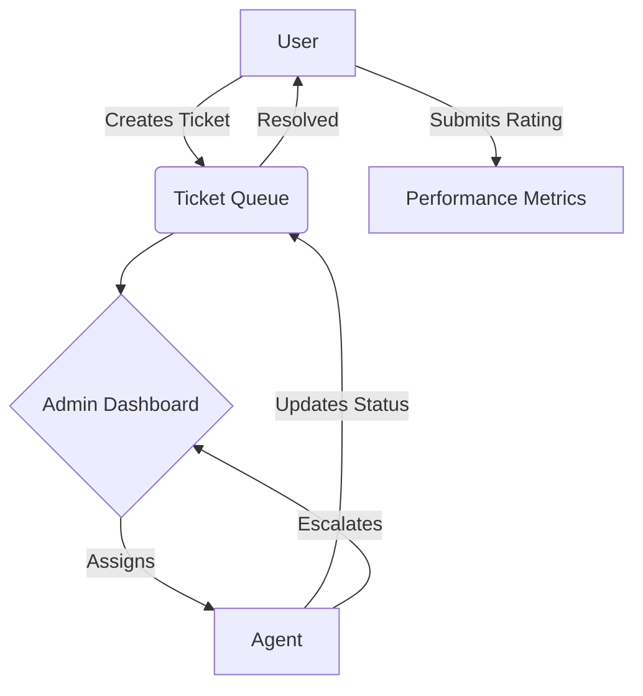

## 🎫 Ticket Management System (TMS)
A robust, full-stack Enterprise Ticket Management System engineered to streamline support workflows. This application facilitates seamless communication between Users, Support Agents, and Administrators through a structured ticket lifecycle, featuring role-based access control (RBAC) and a modern, responsive interface.

## 📌 Overview
In any service-oriented ecosystem, tracking issues efficiently is critical. This project provides a centralized platform to manage the transition of a support request from Open to Resolved. By leveraging Flask for the backend logic and MySQL for relational data integrity, the system ensures that every ticket is tracked, assigned, and audited with precision.

## ⚠️ Problem Statement
Standard communication channels (email/chat) often lead to "lost" support requests, a lack of accountability, and zero visibility into resolution metrics. This system solves these issues by enforcing a strict Ticket Lifecycle and Role Hierarchy.

## 🛠 Tech Stack

| Component   | Technology                    | Role |
|------------|--------------------------------|------|
| Backend    | Python / Flask                 | Core business logic & routing |
| Database   | MySQL                          | Relational data storage |
| ORM        | SQLAlchemy                     | Database abstraction & query management |
| Auth       | Flask-Login                    | Session management & RBAC |
| Frontend   | HTML5, CSS3, JavaScript        | Responsive UI with theme persistence |

## Ticket Lifecycle States:
OPEN: Initial state upon creation.

ASSIGNED: Admin has designated an Agent.

IN_PROGRESS: Agent is actively working on the resolution.

RESOLVED: Task completed; User rating enabled.

ESCALATED: Agent requires Admin intervention.

## 🌟 Key Features
### 🔐 Role-Based Access Control (RBAC)
User: Create tickets, track progress, and provide feedback via a one-time rating system post-resolution.

Agent: Manage assigned workload, update statuses, and communicate via ticket comments.

Admin: Global oversight, user role management, ticket assignment, and analytics dashboard.

### 🎨 Modern UI/UX
Adaptive Theme: Dark/Light mode toggle that persists across sessions using localStorage.

Dynamic Dashboards: Specialized views for different roles to minimize cognitive load.

Real-time Feedback: Status and priority badges for instant visual recognition.

## 🏗 System Architecture & Workflow

## 📂 Project Structure

    ticketing_system/
    ├── app.py                # Application factory & Route definitions
    ├── models.py             # SQLAlchemy Database Schema (User, Ticket, Comment, Rating)
    ├── requirements.txt      # Project dependencies & libraries
    ├── Procfile              # Deployment configuration for PaaS (Heroku/Render)
    │
    ├── templates/            # Jinja2 HTML Templates
    │   ├── login.html        # Authentication: User Login
    │   ├── register.html     # Authentication: User Registration
    │   ├── dashboard.html    # Standard User Portal
    │   ├── admin.html        # Admin Management Console
    │   ├── agent_dashboard.html # Agent-specific Task View
    │   ├── ticket_detail.html # Threaded view for ticket resolution & comments
    │   └── create_ticket.html # Interface for submitting new support requests
    │
    └── static/               # Static Assets
    ├── style.css         # Modern UI styling & Dark/Light mode variables
    └── js/
        ├── theme.js      # LocalStorage-based theme persistence logic
        └── admin_filters.js # Client-side dynamic filtering for Admin tables
  ## ⚙️ Installation & Setup
 ### 1.Prerequisites
  1. Python 3.8+
  2. MySQL Server
  3. Virtual Environment (recommended)
  ### 2.Environment Setup
   #### Clone the repository
    git clone https://github.com/9346mukesh/ResolveX.git
    cd ResolveX

   #### Create and activate a virtual environment
    python -m venv venv
    source venv/bin/activate  # On Windows: venv\Scripts\activate

   #### Install dependencies
    pip install -r requirements.txt
 ### 3. Database Configuration
    app.config['SQLALCHEMY_DATABASE_URI'] = "mysql+pymysql://<user>:<password>@localhost/ticketing_system"
 ### 4. Initialize & Run
    python app.py
  ## 📊 Core Logic Explanation
  1. Rating Guard: The Rating module includes logic to verify the ticket status. Ratings are accepted only if status == 'RESOLVED' and the user_id matches the ticket creator.

  2. Escalation Logic: When an Agent marks a ticket as Escalated, it triggers a flag in the Admin view, moving the ticket to a high-priority "Internal Review" queue.

  3 .Theme Persistence: Implemented via a JavaScript listener that watches for the toggle state and updates the data-theme attribute on the <html> tag.
## 🚀 Future Enhancements
  1. Email Notifications: Automated alerts via Flask-Mail for status updates.
  
  2. Attachment Support: Integration with AWS S3 for uploading error logs/screenshots.
  
  3. SLA Tracking: Visual timers for tickets nearing resolution deadlines.
  
  4. Advanced Analytics: Data visualization using Chart.js for Admin insights.
## 👨‍💻 Author
  Mukesh Kumar Reddy B.Tech – Computer Science & Engineering
